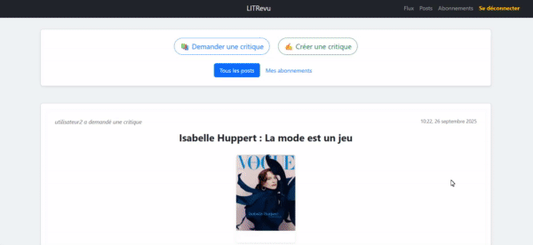

# 📚 LITRevu

LITRevu est une application web développée avec **Django** permettant de créer, partager et consulter des **tickets** (demandes de critiques) ainsi que des **critiques** associées.
Le projet inclut un système d’authentification, d’abonnements entre utilisateurs, et un flux d’actualité avec **scroll infini**.

---

## 🎥 Démonstration

Voici un aperçu du site en action :



---

## 🚀 Fonctionnalités

* **Authentification personnalisée**

  * Inscription et connexion sécurisée
  * Gestion d’un profil avec photo de profil
  * Déconnexion

* **Gestion des tickets et critiques**

  * Créer, modifier et supprimer un ticket
  * Associer une critique à un ticket existant
  * Créer une critique avec ou sans ticket
  * Visualiser tous les détails d’un ticket ou d’une critique

* **Flux d’actualité**

  * Affichage des tickets et critiques dans un flux global
  * Filtrage : *Tous les posts* / *Abonnements uniquement*
  * Pagination avec **scroll infini**
  * Boutons *Voir plus / Voir moins* pour les contenus longs

* **Abonnements**

  * Suivre un utilisateur
  * Se désabonner
  * Bloquer / Débloquer des utilisateurs
  * Recherche avec **autocomplete** pour suivre ou bloquer un utilisateur

* **Interface utilisateur**

  * Design responsive basé sur **Bootstrap 5**
  * Notifications avec **toasts**
  * Aperçu des images lors de l’upload
  * Cartes avec ombre et animations

* **Données de test intégrées**

  * La base de données inclut **des items basiques** (tickets et critiques) afin de disposer de données immédiatement utilisables pour tester l’application.

---

## 🛠️ Installation et utilisation

### 1. Prérequis

* [Python 3.12.1](https://www.python.org/downloads/)
* [Git](https://git-scm.com/)
* [pip](https://pip.pypa.io/en/stable/) (souvent inclus avec Python)
* (Optionnel) [virtualenv](https://virtualenv.pypa.io/) ou [venv](https://docs.python.org/3/library/venv.html)

⚠️ Pour Windows, veillez à installer **Python avec l’option “Add to PATH”**.

---

### 2. Cloner le projet

```bash
git clone https://github.com/NZT48DEV/Projet_9_OC_Application_Django
cd LITRevu
```

---

### 3. Créer un environnement virtuel

#### 🔹 Linux / macOS

```bash
python3 -m venv .env
source .env/bin/activate
```

#### 🔹 Windows (PowerShell)

```powershell
python -m venv .env
.env\Scripts\activate
```

---

### 4. Installer les dépendances

```bash
pip install -r requirements.txt
```

---

### 5. Préparer la base de données

```bash
python manage.py makemigrations
python manage.py migrate
```

---

### 6. Créer un super utilisateur (admin)

```bash
python manage.py createsuperuser
```

Suivez les instructions pour définir un **nom d’utilisateur** et un **mot de passe admin**.

---

### 7. Lancer le serveur de développement

```bash
python manage.py runserver
```

Par défaut, le site sera disponible sur :
👉 [http://127.0.0.1:8000](http://127.0.0.1:8000)

---

## 📂 Structure du projet

```
LITRevu/
│── authentication/   # Gestion utilisateurs (login/signup, profil)
│── core/             # Fichiers statiques, templates de base
│── flake8-report/    # Rapport HTML généré par flake8-html
│── flux/             # Flux principal avec infinite scroll
│── LITRevu/          # Configuration principale Django (settings, urls, wsgi, asgi)
│── media/            # Fichiers médias uploadés par les utilisateurs
│── posts/            # Section "mes posts"
│── reviews/          # Gestion des critiques
│── templates/        # Templates HTML globaux
│── tickets/          # Gestion des tickets et images associées
│── userfollows/      # Gestion abonnements et blocages
│── .flake8           # Configuration flake8
│── .gitignore        # Fichiers/dossiers ignorés par git
│── db.sqlite3        # Base de données SQLite
│── manage.py         # Commandes Django
│── NOTES.md          # Notes de développement
│── pyproject.toml    # Configuration black/isort
│── README.md         # Documentation du projet
│── requirements.txt  # Dépendances Python
```

---

## ⚙️ Technologies utilisées

* **Backend** : Django 5.2.6 (Python 3.12.1)
* **Frontend** : Bootstrap 5, JavaScript (vanilla)
* **Base de données** : SQLite (par défaut, facile à déployer)
* **Gestion des images** : Pillow (PIL)
* **Authentification** : système Django custom User
* **Qualité du code** : Flake8, Black, Isort

---

## 🧹 Vérification et qualité du code

L’ensemble du projet a été vérifié et nettoyé, **aucune erreur flake8 restante** ✅

### Commandes utiles :

* **Flake8** (analyse qualité) :

  ```bash
  flake8
  ```

* **Black** (formatage automatique) :

  ```bash
  black .
  ```

* **Isort** (tri des imports) :

  ```bash
  isort .
  ```

👉 Ces outils garantissent une base de code propre, lisible et homogène.

---

## ✨ Auteur

Projet développé dans le cadre d’un apprentissage Django, à ne pas utiliser en production.
👨‍💻 Inspiré des plateformes de critique comme Twitter/Facebook pour le flux et SensCritique/Goodreads pour les posts.
